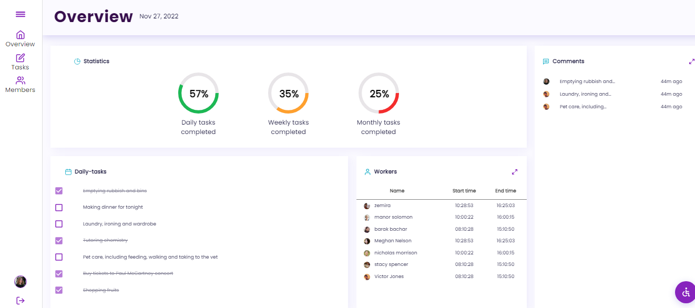
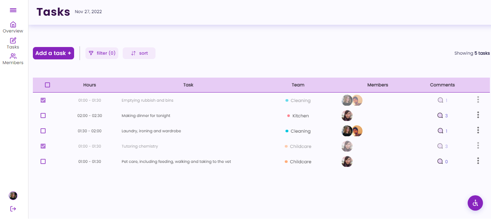
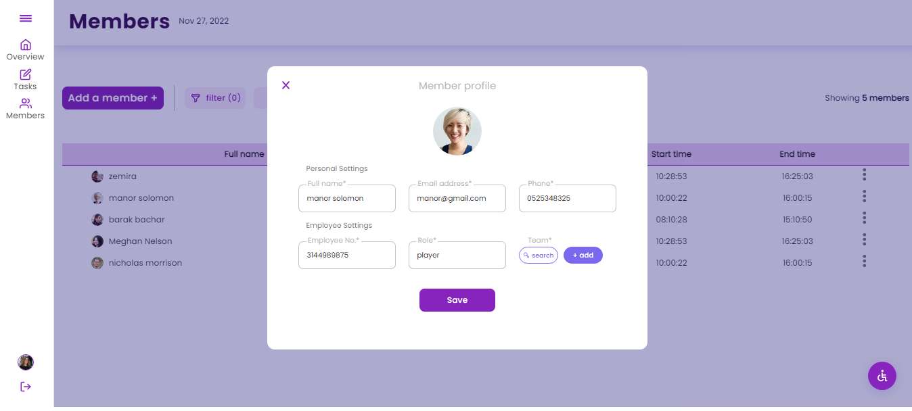
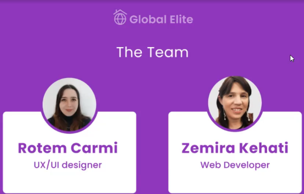

# Task manager - Global Elite

B2B system for household managers - "Global Elite". 
A collaborative project Kula-Like and Digitech communities. 

## Table of contents

- [Overview](#overview)
  - [The challenge](#the-challenge)
  - [Screenshot](#screenshot)
  - [Links](#links)
- [My process](#my-process)
  - [Built with](#built-with)
  - [What I learned](#what-i-learned)
  - [Continued development](#continued-development)
  - [Useful links](#useful-resources)

## Overview

### The challenge

Users should be able to:

- See the quick overview page which includes statistics, daily tasks, workers and comments.
- add a new task or edit an existing task: task name, task hours, team, and members.
- add a new member or edit the details of an existing member: profile image, name, address, phone, role, and team.

### Screenshot

### Links

- Git URL: (https://github.com/zemira-k/task-manager.git)

## My process

### Built with

- React
- Sass
- Grid
- mui
- services
- costum hooks

### What I learned

how to use material ui, and SASS

### Continued development

- log in page
- comments popup
- animations
- hover
- accessibility
- business plans
- workers system
- mobile app

### Useful links

- demo-day video: (https://www.linkedin.com/video/live/urn:li:ugcPost:6973668972365791232/)
